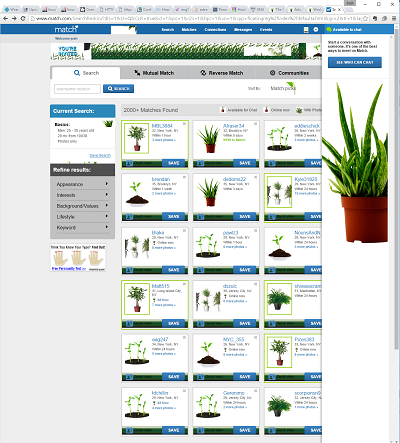

# plantWAP
Transparently injects nature into your browsing experience

## Examples

### Wall Street Journal 


### New York Times


### Feedly


### Match.com




## Background

Created for this project...

http://tegabrain.com/Selected-Work/Eccentric-Engineering


## Installation

Runs on either... 
 * Raspberry Pi 3 
 * Raspberry Pi 2 with [suitable Wifi adapter](http://amzn.to/1UaJ6wX)
  
 You will also need a 2GB+ SD card. 

1. Download latest plantWAP release image under the `releases` tab above
2. Burn it onto the SD card like [this](https://www.raspberrypi.org/documentation/installation/installing-images/)
3. Insert the card into the Pi and turn it on! 
4. After it boots, connect to the Wifi network that looks like a plant
5. To test, you can pull up [this image](http://josh.com/joshpete.gif), which should look like a plant and not two white guys


## Limitations

1. Only replaces images on https connections. Does nothing to images loaded on https connections.
2. Only replaces images that end in standard image file extentions (ie. `png`, `gif`, `jpg`, etc). Does nothing ti images that do not follow these naming conventions even if they have an image MIME type. 
3. It sometimes takes a minute or two before connections from Chrome on Andriod are intercepted. This is likey due to an [Android/Chomium bug](https://bugs.chromium.org/p/chromium/issues/detail?id=339473).

Note that some or all of these limitations could likely be mitigated or cured with more effort. 

## Customization

You can replace the images in the `/etc/plants` with anything you want. 

Keep in mind that these images are resized on the fly to match the intercepted image, so you want large enough to look good when replacing larger soruce images, but the trade off is that large image files take longer to resize so there will be a longer delay the first time an image is injected at a given size. 

After you change the images, you will likely want to clear the cache and restart the server by entering...

```
sudo rm /var/www/html/images/*
sudo squid3 -k reconfigure
```

## Theory of Operation

1. A standard `HOSTAPD` manages the Wifi access point
2. An `iptables` redirect sends all `http` connections to a local `squid3` server 
2. The `squid3` server is set up to run as a `transparent` proxy on port 3128. It runs the url_rewrite_program `/etc/sqrewrite.sh` on each incoming request.
3. The `sqrewrite.sh` script checks the file extention on each request to see if it ends in a common image extention. If not, it passed the request unchanged.
4. If the request was for an image, then we go out and grab the requested image using `wget` and save it to a temp file. 
5. We use `image-magick` to inspect the downloaded image and get the dimensions.
6. Using hash of the oringal URL, we pick one of the repalcement images in `/etc/plant` to inject. Using a hash means that the same orginal image should always get the same replacement so pages look the same when refreshed.
7. We again use `image-magick` to resize the selected repalcement to match the original and save the result in `/var/www/html/images` with a file based on which repalcement images we used and the size. Note that this step can cause some delay if the replacement image is large, but hopefully we only need to resize once per replacement image at a given size. 
8. The script returns the path to the newly generated resized replacement image on the local `appache2` http server on port 81.
9. `squid3` returns the injected image to the browser!
10. 


